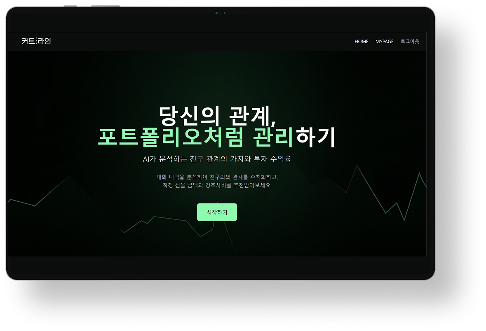
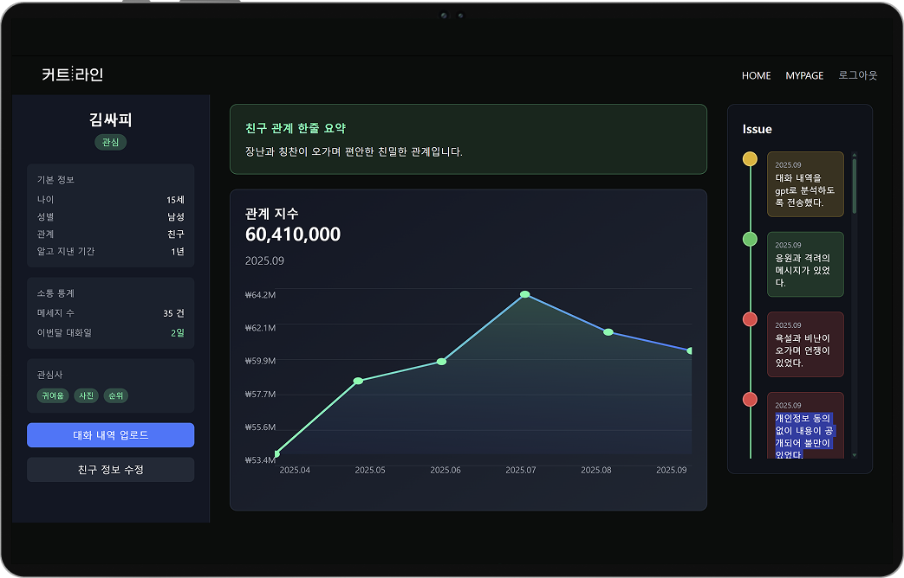
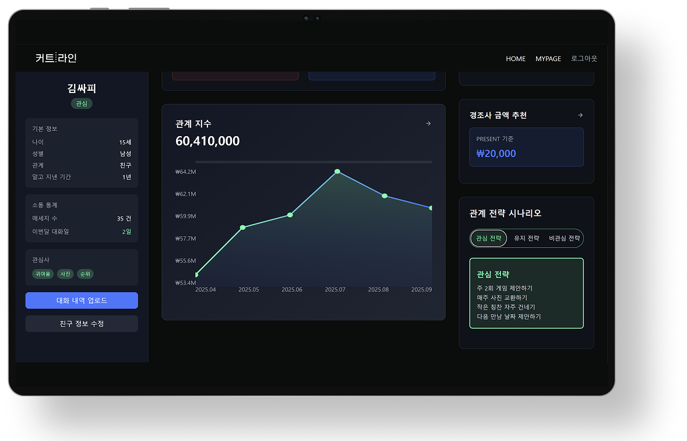
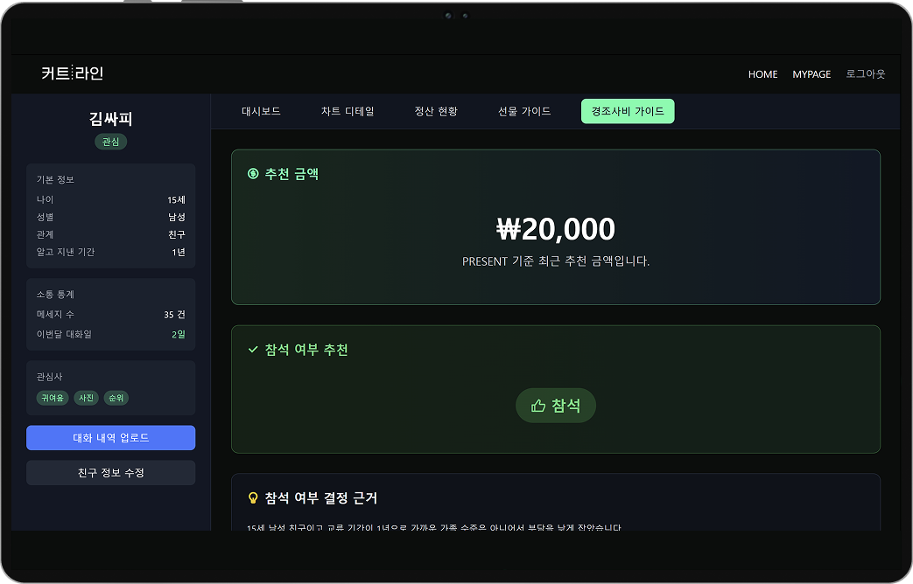
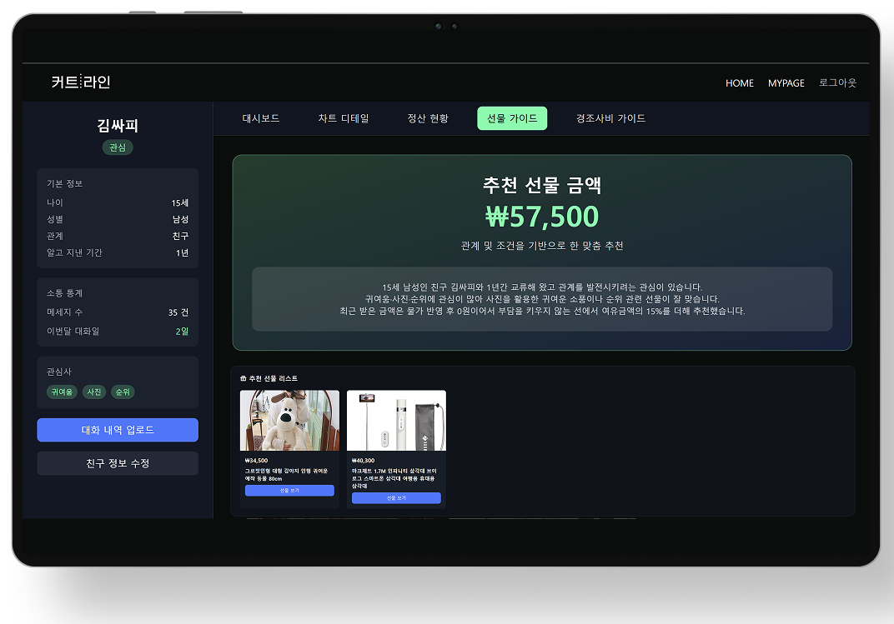

# Cutline — LLM 기반 관계 분석 및 경조사비 · 선물 추천 서비스


> 카카오톡 대화 기록을 분석해 관계 친밀도를 정량화하고,  
> AI 기반으로 **경조사비 금액과 맞춤 선물**을 추천해주는 서비스

---

## 서비스 소개

사회초년생들이 가장 어려워하는 **"경조사비를 얼마 내야 하지?"** 와 **"어떤 선물이 좋을까?"** 의 모호함을 해결하기 위해 기획했습니다.  
카카오톡 대화를 파싱해 관계 친밀도 점수를 산출하고, LLM과 실시간 쇼핑 API를 결합해 **근거 있는** 경조사비·선물 추천을 제공합니다.

---

## 팀 구성

| 역할 | 인원 |
|------|------|
| Frontend | 2명 |
| **Backend** | **3명 (본인 포함)** |
| Infra | 1명 |

---
## 서비스 메인 기능
카카오톡 대화 파일 업로드 시 AI를 통한 대화 분석
1. 월별 주식화 & 대화 속 주요 이슈

2. 관심,비관심에 따른 관계 전력 시나리오 추천


---

## 나의 담당 역할 — Backend Developer

> 백엔드 전반에 기여했으며, 아래 두 기능을 **단독 설계 및 구현**했습니다.

### 1.경조사비 추천 파이프라인
관계 데이터 + 물가상승률을 프롬프트에 주입하는 LLM 기반 금액 산출

### 2. 선물 추천 파이프라인
LLM 검색어 생성 → Naver Shopping API 연동 → 가격 필터링 전 과정 설계


---

## 기술 스택

**Backend**


-412991?style=flat&logo=openai&logoColor=white)

-6DB33F?style=flat)

**Infra**


**Frontend** _(팀원 담당)_


---

## 주요 구현 내용

### 1. LLM Hallucination 제어 — 컨텍스트 주입으로 현실적인 금액 산출

**문제:** LLM에게 단순히 "얼마가 적당한가요?"라고 물으면 물가와 과거 거래 내역을 무시한 비현실적인 금액을 반환하는 Hallucination이 발생했습니다.

**해결:** 프롬프트에 `최근 거래 금액 × 연도별 물가상승률` 보정값, 관계 상태(INTEREST / MAINTAIN / UNINTEREST), 관계 지속 기간 등 **객관적 컨텍스트를 명시적으로 주입**해 LLM의 추론 기반을 고정했습니다. 또한 추천 금액뿐 아니라 **3줄 근거**(소통 패턴 / 관심사 / 과거 거래 내역)를 함께 반환하도록 강제해 사용자 납득도를 높였습니다.

```java
// 과거 거래 금액에 물가상승률을 적용한 보정값을 프롬프트에 주입
Integer latestChangePrice = cashflowService
    .getLatestChangedPrice(person.getId(), category.getId())
    .orElse(0);

// 프롬프트 일부
String prompt = String.format("""
    - 관계 상태: %s
    - 관계 상태에 따른 전략: %s
    - 가장 최근 받은 금액 (물가상승률 반영): %d원
    ...
    근거 형식:
      - 소통 관련 1줄 (나이/성별/관계/지속기간 언급)
      - 관심사 관련 1줄
      - 이전 거래 내역 관련 1줄
    """, personStatus, strategy, latestChangePrice, ...);
```

---

### 2. 선물 추천 2단계 파이프라인 — LLM의 역할을 '검색어 생성'으로 한정

**문제:** LLM이 선물 상품명을 직접 생성하면 실제로 구매할 수 없는 가상의 상품이 등장하는 문제가 발생했습니다.

**설계:** LLM은 **검색어 생성만** 담당하고, 실제 구매 가능한 상품 정보는 Naver Shopping API에서 가져오는 **2단계 파이프라인**으로 분리했습니다. 또한 관심사별 LLM 검색어를 모두 먼저 생성한 뒤 API를 일괄 호출해 재시도 비용을 최소화했습니다.

```
[관심사 토픽 추출]
       ↓
[LLM → 관심사별 쇼핑 검색어 생성] (Map으로 캐싱)
       ↓
[Naver Shopping API → 실제 상품 조회]
       ↓
[예산 범위(60~100%) 필터링]
       ↓
[선물 목록 저장 및 반환]
```

```java
// LLM 검색어를 먼저 전부 생성한 뒤 API 호출 (순서 분리)
Map<String, List<String>> topicToKeywordsMap = new LinkedHashMap<>();
for (Topic topic : existingTopics) {
    List<String> keywords = generateKeywordsForTopic(person, category, freeCash, topic.getTopic());
    topicToKeywordsMap.put(topic.getTopic(), keywords);
}
```

---

### 3. Naver Shopping API Over-fetching — 필터링 후 빈 결과 방지

**문제:** 예산 범위(60~100%)로 필터링 시 최종 결과가 0개가 되는 공백 현상이 발생했습니다.

**해결:** 필요 수량보다 많은 상품을 먼저 요청(Over-fetching)한 뒤 조건에 맞는 상품을 필터링해, 필터링 후에도 안정적인 결과를 확보했습니다.

```java
// 필요 개수보다 넉넉하게 요청한 뒤 가격 범위(60~100%)로 필터링
List<NaverShoppingItem> filteredItems = response.getItems().stream()
    .filter(item -> {
        int price = Integer.parseInt(item.getLprice());
        return price <= maxPrice && price >= maxPrice * 0.6;
    })
    .limit(count)
    .collect(Collectors.toList());
```

---

### 4. LLM 응답 JSON 구조화 — 파싱 안정성 확보

**문제:** LLM이 자유 텍스트로 응답하면 파싱 결과가 매번 달라져 서비스가 불안정해집니다.

**해결:** System Prompt에 JSON 스키마, 필드 타입, 예시를 명시하여 **구조화된 응답을 강제**하고, `ObjectMapper`로 바로 역직렬화할 수 있도록 했습니다.

```java
String systemPrompt = """
    다음 JSON 형식만 반환해. 다른 텍스트는 절대 포함하지 마.
    예시: {"attendance": true, "price": 50000, "content": "..."}
    규칙:
    - attendance: 반드시 boolean (true/false, 문자열 아님)
    - price: 반드시 integer
    - content: 반드시 string
    """;

return objectMapper.readValue(jsonResponse, LlmFamilyEventData.class);
```

---

### 5. 관계 상태별 가격 전략 — 금액 추천에 '의도'를 반영

단순한 금액 추천을 넘어, 사용자가 해당 관계를 **어떻게 가져가고 싶은지**에 따라 추천 금액 범위를 달리 적용했습니다.

| 관계 상태 | 의미 | 가격 전략 |
|-----------|------|----------|
| `INTEREST` | 가까워지고 싶음 | 여유금액 **+10~20%** |
| `MAINTAIN` | 현재 관계 유지 | 여유금액 **그대로** |
| `UNINTEREST` | 멀어지고 싶음 | 여유금액 **-10~20%** |

---

## 실행 방법

### 사전 준비

`.env.example`을 복사해 `.env` 파일을 생성하고 값을 채웁니다.

```bash
cp .env.example .env
```

필요한 환경 변수:

| 변수명 | 설명 |
|--------|------|
| `SPRING_DATASOURCE_URL` | PostgreSQL 연결 URL |
| `SPRING_DATASOURCE_USERNAME` | DB 사용자명 |
| `SPRING_DATASOURCE_PASSWORD` | DB 비밀번호 |
| `SPRING_AI_OPENAI_API_KEY` | OpenAI API 키 |
| `KAKAO_CLIENT_ID` | 카카오 OAuth2 Client ID |
| `KAKAO_CLIENT_SECRET` | 카카오 OAuth2 Client Secret |
| `SPRING_NAVER_SHOPPING_CLIENT_ID` | 네이버 쇼핑 API Client ID |
| `SPRING_NAVER_SHOPPING_CLIENT_SECRET` | 네이버 쇼핑 API Client Secret |
| `APP_JWT_SECRET` | JWT 서명 키 (32자 이상) |
| `APP_OAUTH2_REDIRECT_URI` | OAuth2 리디렉션 URI |

### 로컬 실행 (Docker Compose)

```bash
# PostgreSQL 실행
docker-compose -f docker-compose.postgres.yml up -d

# 메인 백엔드 실행
docker-compose -f docker-compose.main.yml up -d

# 파싱 서버 실행
docker-compose -f docker-compose.parsing.yml up -d

# Nginx 리버스 프록시 실행
cd nginx && docker-compose up -d
```

### 편의 스크립트

```bash
# 메인 서버 시작/중지/로그 확인
./app.sh start
./app.sh stop
./app.sh logs
```

---

## 아키텍처

```
[Frontend (React/Vercel)]
        ↓
[Nginx Reverse Proxy]
   ↙         ↘
[Main BE]  [Parsing BE]
(경조사/선물)  (카카오톡 분석)
   ↓              ↓
[PostgreSQL (RDS)]
   ↓
[External APIs]
  ├── OpenAI GPT (LLM)
  └── Naver Shopping API
```
